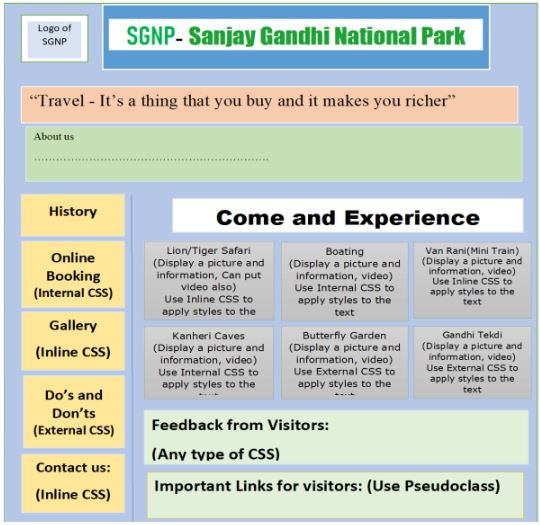

# Sanjay Gandhi National Park

A sample webpage was created for **Sanjay Gandhi National Park** using different HTML and CSS.

## Problem Statement
Write and execute an HTML and CSS3 code to design a webpage for a National Park as per
the given details.

The following features are expected to be used -

• Color, Background, Fonts

• Tables, Lists

• CSS3 selectors

• Pseudo classes, Pseudo elements

## Deployment

The Webpage has been deployed on github pages.

## Access Webpage

To view the Webpage Visit the link given below:

https://adj46.github.io/Sanjay_Gandhi_National_Park/
